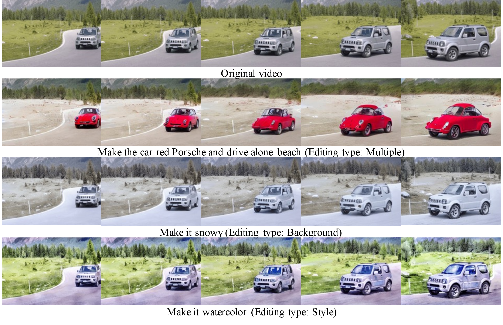

<style>
    .gif-container {
        display: flex;
        flex-wrap: wrap;
    }

    .gif-item {
        flex: 1 1 calc(50% - 10px); /* Makes sure there are only 2 items per row with a gap of 10px */
        margin: 5px; /* This provides the gap */
    }
    .custom-link {
      font-family: 'Arial', sans-serif; /* or any other font */
      font-size: 1.2em; /* adjust as needed */
      font-weight: bold;
      color: #3498db; /* a blue color, adjust as needed */
    }
    .title {
        text-align: center;     /* Centers the text */
        font-size: 2em;         /* Sets a large font size */
        font-weight: bold;      /* Makes the font bold for emphasis */
        margin-top: 1em;     /* Provides some space below the title */
    }
    .papertitle {
        text-align: center;
        font-size: 2.5em;
        font-weight: bold;
        color: #333;
    }
    .author {
        text-align: center;
        font-size: 1.5em;
        margin-top: 0.2em;
        margin-bottom: 0.2em;
        color: #555;
    }
    .affiliation {
        text-align: center;
        font-size: 1.2em;
        font-style: italic;
        color: #777;
        margin-bottom: 1em;
    }
</style>

<style>
.button-container {
  display: flex;
  gap: 10px; /* Adjust space between buttons as needed */
  justify-content: center; /* Center horizontally */
  align-items: center;     /* Center vertically */
}

.button {
  padding: 12px 30px; /* Adjust padding as needed */
  border: none;
  border-radius: 30px; /* Adjust for desired corner rounding */
  background-color: #333; /* Dark background */
  color: #FFF; /* White text */
  font-family: Arial, sans-serif; /* Adjust font as needed */
  /* font-weight: bold; */
  font-size: 1.2em; /* Adjust font size as needed */
  cursor: pointer; /* Hand cursor on hover */
  display: flex;
  align-items: center;
  gap: 5px; /* Adjust space between icon and text */
  margin-bottom: 1em;
}

.button:hover {
  background-color: #555; /* Slightly lighter background on hover */
}

.button img {
  width: 35px; /* Adjust as needed */
  height: 30px; /* Adjust as needed */
}

</style>

<div class="papertitle"> Consistent Video-to-Video Transfer Using Synthetic Dataset </div>

<div class="author">Jiaxin Cheng, Tianjun Xiao, Tong He</div>
<div class="affiliation">Amazon Web Services, Shanghai AI Lab</div>


<div class="button-container">
  <button class="button">
    arXiv
  </button>
  <button class="button">
    Github
  </button>
</div>




<div class="title"> Abstract </div>
We introduce a novel and efficient approach for text-based video-to-video editing that eliminates the need for resource-intensive per-video-per-model finetuning. At the core of our approach is a synthetic paired video dataset tailored for video-to-video transfer tasks. Inspired by Instruct Pix2Pix's image transfer via editing instruction, we adapt this paradigm to the video domain. Extending the Prompt-to-Prompt to videos, we efficiently generate paired samples, each with an input video and its edited counterpart. Alongside this, we introduce the Long Video Sampling Correction during sampling, ensuring consistent long videos across batches. Our method surpasses current methods like Tune-A-Video, heralding substantial progress in text-based video-to-video editing and suggesting exciting avenues for further exploration and deployment.

<div class="title"> Results </div>

<div class="gif-container">
    
        
            <div class="gif-item">
                
            </div>
        
    
</div>

<div class="title"> Synthetic Paired Video Dataset </div>


<div class="title"> Bibex </div>

```plaintext
@article{insv2v,
  title={Consistent Video-to-Video Transfer Using Synthetic Dataset},
  author={Jiaxin Cheng, Tianjun Xiao, Tong He},
  year={2023},
}
```
